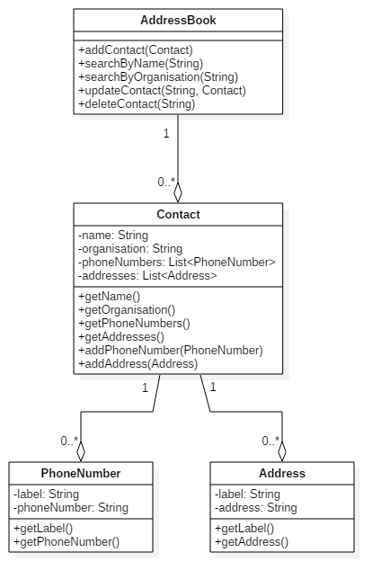

Contacts

You have to implement an application for managing contacts according to the given UML class diagram. Details about each class and its members is given below.

PhoneNumber (PhoneNumber.java): represents a phone number. It has two attributes,
    
    1. label: short description for the phoneNumber. It must contain only letters of English Alphabet and whitespace. It cannot be empty and its length should not exceed 255 characters. Example: "work", "home".
    2. phoneNumber: It represents the phone number. It should contain exactly 10 digits.

Address (Address.java): represents an address. It has two attributes,

	1. label: short description for the address. It must contain only letters of English Alphabets and whitespace. It cannot be empty and its length should not exceed 255 characters. Example: "office", "residential".
	2. address: It represents the address.

Contact (Contact.java): represents a contact. It has four attributes,
	
	1. name: It represents the name of the person. It must contain only letters of English Alphabet and whitespace. It cannot be empty and its length should not exceed 255 characters. Example: "John Doe".
	2. organisation: it represents the organisation to which this person belongs to. It may contain any character or be empty, however its length should not exceed 255 characters.
	3. phoneNumbers: is a collection of PhoneNumber.
	4. addresses: is a collection of Address.
    
    Other than getters for attributes, it also has two more operations,
	1. addPhoneNumber(PhoneNumber): It accepts a single parameter, an instance of the class PhoneNumber and adds it to phoneNumbers.
	2. addAddress(Address): It accepts a single parameter, an instance of the class Address and adds it to Addresses.

Note: If any attribute violates its constraints, the application must raise an exception.

AddressBook (AddressBook.java): represents an Address Book, it maintains a collection of Contact and allows following operations,
	
	1. addContact(Contact): adds a contact to the address book. Each contact is uniquely identifiable by its name, i.e. No two contacts in an address book can have same names, in case of duplicate contacts raise an exception.
	2. searchByName(String): this returns a List<Contact> containing all the contacts which have in their name the prefix specified by the String parameter. Example: Assume that the address book has contacts for "John", "James" and "Jack", searching by "Ja" should return a list containing contacts for "James" and "Jack". The search is case-insensitive, i.e searching with "jA" should fetch same result. Searching with an empty string should return all the contacts.
	3. searchByOrganisation(String): this returns a List<Contact> containing all the contacts which have in their organisation the prefix specified by the String parameter. Example: Assume that the address book has contacts with organisations "HackerEarth", "HackerMars" and "HackerJupiter", searching by "Hacker" should return a list containing contacts with organisations "HackerEarth", "HackerMars" and "HackerJupiter". The search is case-insensitive, i.e searching with "hacker" should fetch same result. Searching with an empty string should return all the contacts.
	4. updateContact(String, Contact): It updates contact with name as specified by the String parameter with new contact specified by Contact parameter. Note: Update may lead to a duplicate contact, in that case raise an exception and leave address book unchanged. Also, if name specified by the String parameter does not exist, raise an exception.
	5. deleteContact(String): It deletes the contact with name as specified by the String parameter from the address book. If no such contact exists, raise an exception.

